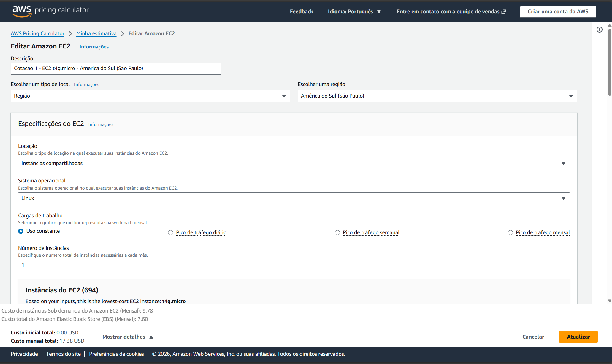
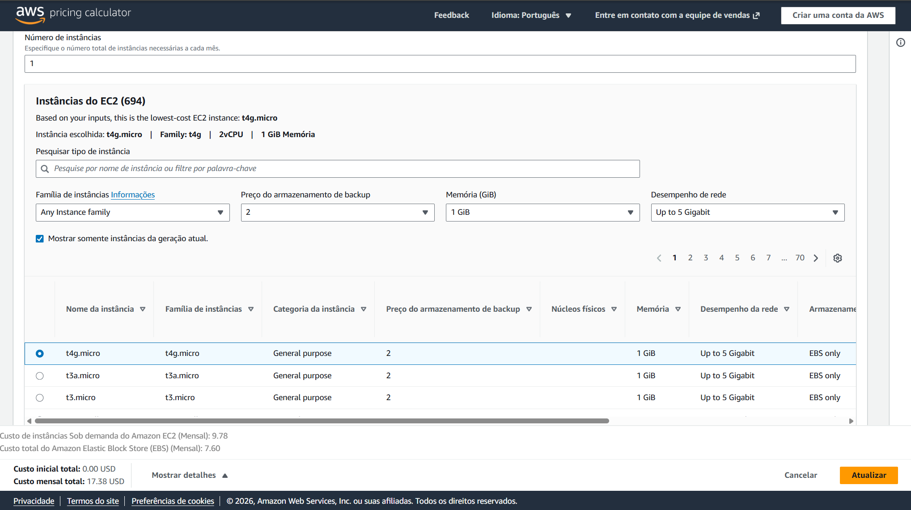
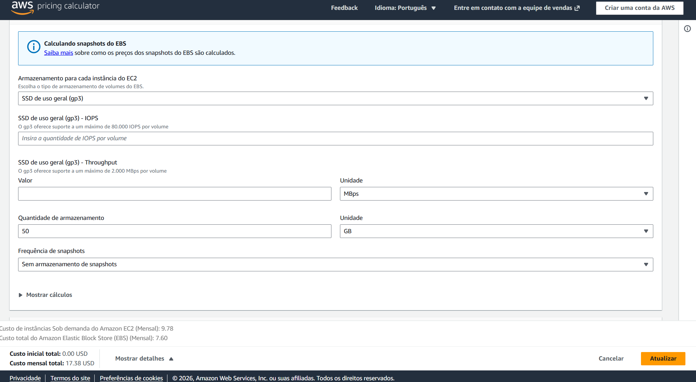
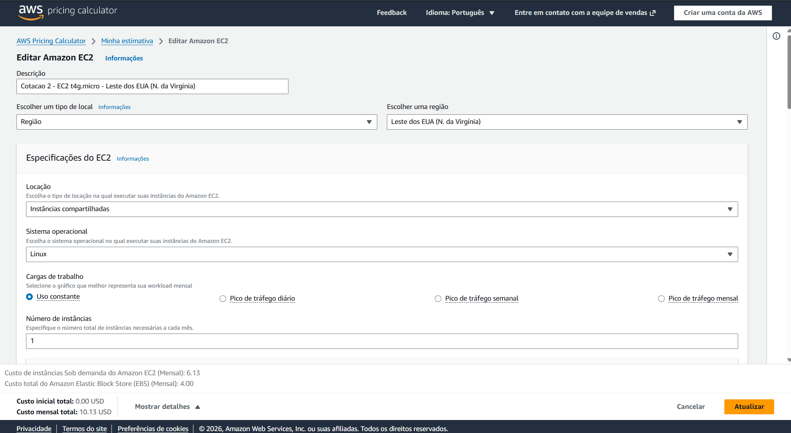
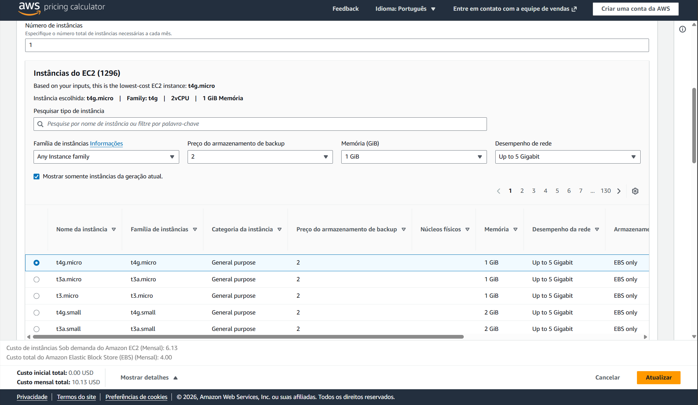
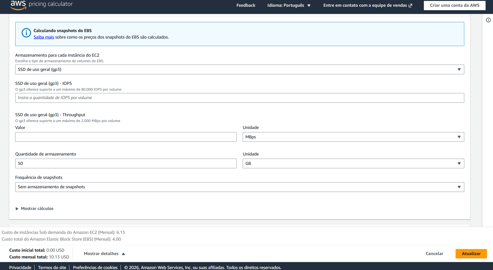
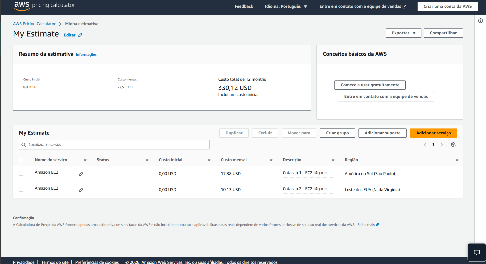

# FarmTech Solutions — Fase 5

**Autora:** Leticia Eltermann — **RM 568645**

---

## Sobre o projeto

A FarmTech Solutions quer saber se as condições climáticas registradas em sua área de
produção permitem antecipar o rendimento das safras, e quanto custaria hospedar na AWS
a API que recebe a telemetria dos sensores de campo. Esta fase responde às duas
perguntas: a primeira com um estudo de aprendizado de máquina sobre um conjunto de
quatro culturas — cacau, dendê, arroz e seringueira — e quatro variáveis climáticas; a
segunda com uma cotação comparada entre as regiões de São Paulo e do Norte da Virgínia.

A **Entrega 1** é um notebook Jupyter com análise exploratória, clusterização das
condições climáticas com identificação de cenários discrepantes, e cinco algoritmos
preditivos avaliados contra um piso de comparação explícito. A **Entrega 2** é a
comparação de custos de infraestrutura, com a decisão de região justificada por
latência, conformidade regulatória e viabilidade econômica. Cada entrega tem seu
próprio vídeo de apresentação, referenciado nas seções abaixo.

---

## Entrega 1 — Machine Learning

📓 **Notebook:** [`LeticiaEltermann_rm568645_pbl_fase4.ipynb`](LeticiaEltermann_rm568645_pbl_fase4.ipynb)

🎥 **Vídeo de apresentação:** [INSERIR LINK]

### O que o trabalho descobriu

O conjunto tem 156 linhas, mas apenas **39 observações climáticas distintas**: as
quatro variáveis de clima se repetem idênticas para as quatro culturas. A consequência
governa todo o resto. Um modelo que ignora o clima por completo e prediz apenas a média
histórica de cada cultura já atinge **R² de 0,988** — quase toda a variância do
rendimento é explicada por *qual cultura é*, não pelo tempo que fez. Qualquer R² alto
neste problema precisa ser lido contra esse piso, e não contra zero.

Medido assim, o resultado de modelagem é desconfortável e é o ponto central do trabalho.
Sob validação cruzada convencional, um único dos cinco algoritmos supera o piso, por
5,9%. Sob validação cruzada em blocos temporais — que respeita a ordem sequencial das
observações, detectada por teste de permutação no próprio notebook — **o mesmo modelo
passa a ficar 10,5% abaixo do piso**. Os dois resultados são estatisticamente
indistinguíveis de zero (p = 0,40 e p = 0,39). O que se pode afirmar não é que o modelo
ajuda nem que atrapalha, mas que o sinal muda de direção conforme uma escolha de
desenho de validação, e que os dados não têm poder para decidir.

O notebook também não esconde a exceção. Entre 63 testes de hipótese, um único resultado
sobrevive simultaneamente à correção de Bonferroni, ao controle de tendência temporal e
à correção por autocorrelação: a relação **negativa entre umidade específica e
rendimento do dendê**, invisível na correlação bruta e com R² de 0,40 depois de removida
a tendência. É o único candidato a sinal climático real no conjunto — e o notebook diz
por que ele não deve ser generalizado.

### Como reproduzir

```bash
git clone <url-do-repositorio>
cd farmtech-fase5
pip install -r requirements.txt
jupyter notebook LeticiaEltermann_rm568645_pbl_fase4.ipynb
```

O notebook é determinístico (`RANDOM_STATE = 42` em todos os pontos estocásticos) e roda
de ponta a ponta em *Restart & Run All* a partir da raiz do repositório, sem editar
caminhos. As versões fixadas em `requirements.txt` são exatamente aquelas em que os
números publicados foram gerados.

---

## Entrega 2 — Computação em Nuvem

### Configuração cotada

A cotação foi feita na AWS Pricing Calculator com **configuração idêntica nas duas
regiões**, para que a única variável seja a localização: instância EC2 Linux,
On-Demand 100%, uso constante, 1 instância, locação compartilhada, tipo **t4g.micro**
(2 vCPU, 1 GiB de memória, rede de até 5 Gigabit), com volume **EBS gp3 de 50 GB** sem
snapshots.


*São Paulo — região, sistema Linux e perfil de uso constante; rodapé fecha em 17,38 USD/mês.*


*São Paulo — filtros de 2 vCPU, 1 GiB e até 5 Gigabit; t4g.micro selecionada.*


*São Paulo — armazenamento gp3 de 50 GB, sem snapshots.*


*Norte da Virgínia — os mesmos campos preenchidos; rodapé fecha em 10,13 USD/mês.*


*Norte da Virgínia — mesmos filtros e **a mesma instância t4g.micro** selecionada em São Paulo: é a identidade de hardware entre as duas cotações que torna a comparação de preços válida.*


*Norte da Virgínia — armazenamento gp3 de 50 GB, sem snapshots.*

### Comparação de custos

| Item | São Paulo | Norte da Virgínia | Diferença |
|---|---:|---:|---:|
| Instância | t4g.micro | t4g.micro | — |
| EC2 mensal | 9,78 USD | 6,13 USD | **+59,5%** |
| EBS 50 GB mensal | 7,60 USD | 4,00 USD | **+90,0%** |
| **Total mensal** | **17,38 USD** | **10,13 USD** | **+71,6%** |
| **Total em 12 meses** | **208,56 USD** | **121,56 USD** | **+87,00 USD** |

A diferença não é uniforme entre os componentes: o armazenamento é quase o dobro do
preço em São Paulo (+90,0%), enquanto a computação é cerca de 60% mais cara. Como a
configuração é idêntica nas duas cotações, toda a diferença é atribuível à região.


*Tela "Minha estimativa" com as duas cotações lado a lado — 17,38 USD/mês em São Paulo
contra 10,13 USD/mês no Norte da Virgínia, com a mesma configuração nas duas. Os totais de
27,51 USD/mês e 330,12 USD/ano exibidos no rodapé são a **soma das duas estimativas** no
mesmo orçamento, não o custo da solução: a solução é uma região ou a outra.*

### Qual é a solução mais barata?

**O Norte da Virgínia**, sem ambiguidade. São Paulo custa **71,6% a mais** por mês —
17,38 USD contra 10,13 USD — o que representa **87,00 USD a mais ao longo de doze
meses** para exatamente a mesma capacidade computacional e o mesmo volume de
armazenamento.

### Qual opção eu escolheria, e por quê?

**São Paulo** — que não é a opção mais barata. A escolha se apoia em três argumentos,
nesta ordem de peso.

**1. Latência.** A aplicação não é um processamento em lote: é uma API que recebe
telemetria contínua de sensores instalados em campo e precisa responder em tempo real.
A distância entre São Paulo e a região do Norte da Virgínia é de aproximadamente
7.600 km, e a velocidade de propagação em fibra óptica é de cerca de dois terços da
velocidade da luz. Só isso já impõe um **piso físico de aproximadamente 76 ms de ida e
volta**, antes de qualquer roteamento, enfileiramento ou processamento — latência que
nenhuma otimização de software recupera, porque é imposta pela geografia. O valor real
medido seria mais alto que esse piso. Hospedar em São Paulo mantém o trajeto dentro do
país e elimina essa penalidade na origem.

**2. Soberania de dados.** Convém ser preciso aqui, porque a formulação comum é
incorreta: **a LGPD (Lei 13.709/2018) não proíbe o armazenamento de dados fora do
Brasil.** O que ela faz é *condicionar* a transferência internacional a hipóteses legais
específicas — decisão de adequação da ANPD sobre o país de destino, cláusulas
contratuais padrão, normas corporativas globais, selos e certificados, ou consentimento
específico e destacado do titular, entre outras previstas no Art. 33. Nenhuma dessas
hipóteses é intransponível, mas todas exigem que a organização constitua, documente e
mantenha a base legal, e que a sustente perante a autoridade em caso de fiscalização.
Manter os dados em território nacional **não torna a operação legal onde ela seria
ilegal — torna desnecessário todo esse ônus de conformidade.** Para uma operação do
porte da FarmTech, esse é um custo administrativo recorrente que compete diretamente
com a economia de infraestrutura.

**3. Viabilidade econômica.** O trade-off é explícito e pequeno: **87,00 USD por ano**.
Esse é o preço integral de comprar, ao mesmo tempo, a latência menor e a dispensa do
processo de conformidade para transferência internacional. Vale reconhecer sem rodeios
que São Paulo é a região mais cara e que a decisão implica pagar mais — mas 87 dólares
anuais é ordem de grandeza inferior ao custo de horas técnicas e jurídicas necessárias
para instruir e manter uma base legal de transferência internacional, e inferior ao
custo de uma API de campo que responde devagar. A conta muda se a carga crescer muito:
como a diferença é percentual e não fixa, uma infraestrutura dez vezes maior tornaria a
economia de 870 USD anuais um argumento a ser reavaliado.

🎥 **Vídeo de apresentação:** [INSERIR LINK]

---

## Estrutura do repositório

```
farmtech-fase5/
├── LeticiaEltermann_rm568645_pbl_fase4.ipynb   Entrega 1 — notebook completo, executado
├── crop_yield.csv                              dados de origem (156 linhas, 4 culturas)
├── requirements.txt                            dependências, nas versões validadas
├── README.md                                   este arquivo
├── assets/
│   └── prints/                                 evidências da cotação AWS (Entrega 2)
│       ├── aws-sp-config.png
│       ├── aws-sp-instancia.png
│       ├── aws-sp-ebs.png
│       ├── aws-va-config.png
│       ├── aws-va-instancia.png
│       ├── aws-va-ebs.png
│       └── aws-comparativo.png
└── ir-alem/                                    material complementar
```
