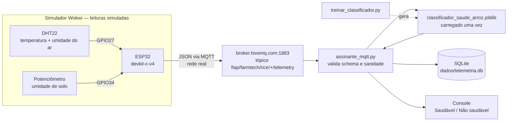
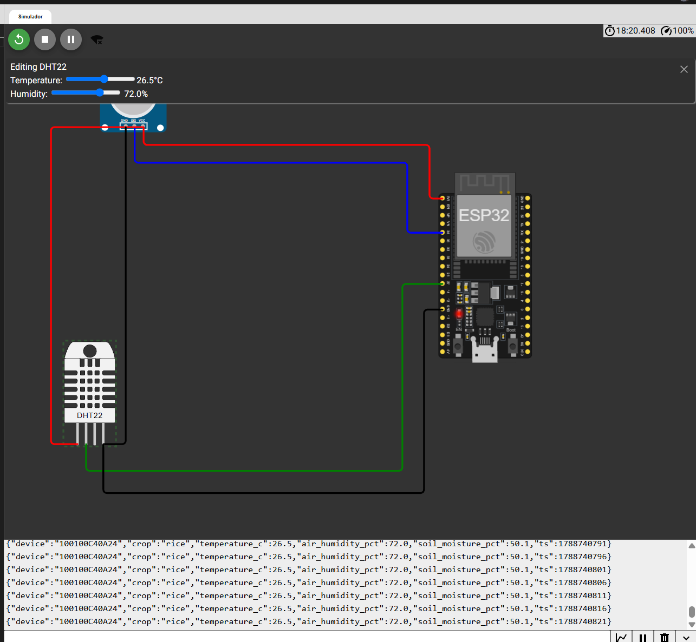

# FarmTech Solutions — Fase 5

**Autora:** Leticia Eltermann — **RM 568645**


---

## Sobre o projeto

A FarmTech Solutions quer saber se as condições climáticas registradas em sua área de
produção permitem antecipar o rendimento das safras, e quanto custaria hospedar na AWS
a API que recebe a telemetria dos sensores de campo.

Esta fase responde às duas perguntas: a primeira com um estudo de aprendizado de
máquina sobre um conjunto de quatro culturas — cacau, dendê, arroz e seringueira — e
quatro variáveis climáticas; a segunda com uma cotação comparada entre as regiões de
São Paulo e do Norte da Virgínia.

A **Entrega 1** é um notebook Jupyter com análise exploratória, clusterização das
condições climáticas com identificação de cenários discrepantes, e cinco algoritmos
preditivos avaliados contra um piso de comparação explícito.

A **Entrega 2** é a comparação de custos de infraestrutura, com a decisão de região
justificada por latência, conformidade regulatória e viabilidade econômica. Cada
entrega tem seu próprio vídeo de apresentação, referenciado nas seções abaixo.

---

## Entrega 1 — Machine Learning

📓 **Notebook:** [`LeticiaEltermann_rm568645_pbl_fase4.ipynb`](LeticiaEltermann_rm568645_pbl_fase4.ipynb)

🎥 **Vídeo de apresentação:** https://www.youtube.com/watch?v=1yPK3VSU7Pg

### O que o trabalho descobriu

O conjunto tem **156 linhas**, mas apenas **39 observações climáticas distintas**: as
quatro variáveis de clima se repetem idênticas para as quatro culturas. A consequência
governa todo o resto.

Um modelo que ignora o clima por completo e prediz apenas a média histórica de cada
cultura já atinge **R² de 0,988** — quase toda a variância do rendimento é explicada
por *qual cultura é*, não pelo tempo que fez. Qualquer R² alto neste problema precisa
ser lido contra esse piso, e não contra zero.

Medido assim, o resultado de modelagem é desconfortável e é o ponto central do
trabalho. Sob validação cruzada convencional, um único dos cinco algoritmos supera o
piso, por **5,9%**. Sob validação cruzada em blocos temporais — que respeita a ordem
sequencial das observações, detectada por teste de permutação no próprio notebook —
**o mesmo modelo passa a ficar 10,5% abaixo do piso**.

Os dois resultados são estatisticamente indistinguíveis de zero (**p = 0,40** e
**p = 0,39**). O que se pode afirmar não é que o modelo ajuda nem que atrapalha, mas
que o sinal muda de direção conforme uma escolha de desenho de validação, e que os
dados não têm poder para decidir.

O notebook também não esconde a exceção. Entre **63 testes de hipótese**, um único
resultado sobrevive simultaneamente à correção de Bonferroni, ao controle de tendência
temporal e à correção por autocorrelação: a relação **negativa entre umidade específica
e rendimento do dendê**, invisível na correlação bruta e com **R² de 0,40** depois de
removida a tendência.

É o único candidato a sinal climático real no conjunto — e o notebook diz por que ele
não deve ser generalizado.

### Como reproduzir

```bash
git clone <url-do-repositorio>
cd farmtech-fase5
pip install -r requirements.txt
jupyter notebook LeticiaEltermann_rm568645_pbl_fase4.ipynb
```

O notebook é determinístico (`RANDOM_STATE = 42` em todos os pontos estocásticos) e
roda de ponta a ponta em *Restart & Run All* a partir da raiz do repositório, sem
editar caminhos. As versões fixadas em `requirements.txt` são exatamente aquelas em que
os números publicados foram gerados.

---

## Entrega 2 — Computação em Nuvem

### Configuração cotada

A cotação foi feita na AWS Pricing Calculator com **configuração idêntica nas duas
regiões**, para que a única variável seja a localização:

| Parâmetro | Valor |
|---|---|
| Instância | **t4g.micro** — 2 vCPU, 1 GiB de memória, rede de até 5 Gigabit |
| Sistema | EC2 Linux, locação compartilhada |
| Uso | On-Demand 100%, uso constante, 1 instância |
| Armazenamento | **EBS gp3 de 50 GB**, sem snapshots |


*São Paulo — região, sistema Linux e perfil de uso constante; rodapé fecha em
17,38 USD/mês.*


*São Paulo — filtros de 2 vCPU, 1 GiB e até 5 Gigabit; t4g.micro selecionada.*


*São Paulo — armazenamento gp3 de 50 GB, sem snapshots.*


*Norte da Virgínia — os mesmos campos preenchidos; rodapé fecha em 10,13 USD/mês.*


*Norte da Virgínia — mesmos filtros e **a mesma instância t4g.micro** selecionada em
São Paulo. É a identidade de hardware entre as duas cotações que torna a comparação de
preços válida.*


*Norte da Virgínia — armazenamento gp3 de 50 GB, sem snapshots.*

### Comparação de custos

| Item | São Paulo | Norte da Virgínia | Diferença |
|---|---:|---:|---:|
| Instância | t4g.micro | t4g.micro | — |
| EC2 mensal | 9,78 USD | 6,13 USD | +59,5% |
| EBS 50 GB mensal | 7,60 USD | 4,00 USD | +90,0% |
| **Total mensal** | **17,38 USD** | **10,13 USD** | **+71,6%** |
| **Total em 12 meses** | **208,56 USD** | **121,56 USD** | **+87,00 USD** |

A diferença não é uniforme entre os componentes: o armazenamento é quase o dobro do
preço em São Paulo (+90,0%), enquanto a computação é cerca de 60% mais cara.

Como a configuração é idêntica nas duas cotações, toda a diferença é atribuível à
região.


*As duas cotações lado a lado na tela "Minha estimativa" — 17,38 USD/mês em São Paulo
contra 10,13 USD/mês no Norte da Virgínia, com a mesma configuração nas duas. Os totais
de 27,51 USD/mês e 330,12 USD/ano exibidos no rodapé são a **soma das duas estimativas**
no mesmo orçamento, não o custo da solução: a solução é uma região ou a outra.*

### Qual é a solução mais barata?

**O Norte da Virgínia**, sem ambiguidade. São Paulo custa **71,6% a mais** por mês —
17,38 USD contra 10,13 USD — o que representa **87,00 USD a mais ao longo de doze
meses** para exatamente a mesma capacidade computacional e o mesmo volume de
armazenamento.

### Qual opção eu escolheria, e por quê?

**São Paulo** — que não é a opção mais barata. A escolha se apoia em três argumentos,
nesta ordem de peso.

**1. Latência.** A aplicação não é um processamento em lote: é uma API que recebe
telemetria contínua de sensores instalados em campo e precisa responder em tempo real.

A distância entre São Paulo e a região do Norte da Virgínia é de aproximadamente
**7.600 km**, e a velocidade de propagação em fibra óptica é de cerca de dois terços da
velocidade da luz. Só isso já impõe um **piso físico de aproximadamente 76 ms de ida e
volta**, antes de qualquer roteamento, enfileiramento ou processamento — latência que
nenhuma otimização de software recupera, porque é imposta pela geografia. O valor real
medido seria mais alto que esse piso. Hospedar em São Paulo mantém o trajeto dentro do
país e elimina essa penalidade na origem.

**2. Soberania de dados.** Convém ser preciso aqui, porque a formulação comum é
incorreta: **a LGPD (Lei 13.709/2018) não proíbe o armazenamento de dados fora do
Brasil.** O que ela faz é *condicionar* a transferência internacional a hipóteses legais
específicas — decisão de adequação da ANPD sobre o país de destino, cláusulas
contratuais padrão, normas corporativas globais, selos e certificados, ou consentimento
específico e destacado do titular, entre outras previstas no **Art. 33**.

Nenhuma dessas hipóteses é intransponível, mas todas exigem que a organização
constitua, documente e mantenha a base legal, e que a sustente perante a autoridade em
caso de fiscalização. Manter os dados em território nacional **não torna a operação
legal onde ela seria ilegal — torna desnecessário todo esse ônus de conformidade.**
Para uma operação do porte da FarmTech, esse é um custo administrativo recorrente que
compete diretamente com a economia de infraestrutura.

**3. Viabilidade econômica.** O trade-off é explícito e pequeno: **87,00 USD por ano**.
Esse é o preço integral de comprar, ao mesmo tempo, a latência menor e a dispensa do
processo de conformidade para transferência internacional.

Vale reconhecer sem rodeios que São Paulo é a região mais cara e que a decisão implica
pagar mais — mas 87 dólares anuais é ordem de grandeza inferior ao custo de horas
técnicas e jurídicas necessárias para instruir e manter uma base legal de transferência
internacional, e inferior ao custo de uma API de campo que responde devagar.

A conta muda se a carga crescer muito: como a diferença é percentual e não fixa, uma
infraestrutura dez vezes maior tornaria a economia de **870 USD anuais** um argumento a
ser reavaliado.

🎥 **Vídeo de apresentação:** https://www.youtube.com/watch?v=nYzUWreKDQM

---

## Ir Além — Classificação de saúde da plantação com ML e ESP32

Um nó ESP32 publica telemetria por MQTT; um assinante Python classifica cada
leitura como **Saudável** ou **Não saudável** e persiste o resultado.

🎥 **Vídeo de apresentação:** https://www.youtube.com/watch?v=OQc2-ghvqIQ

### Por que arroz, e por que estes dois sensores

**A cultura é arroz**, a mesma da Entrega 1, para que as duas partes conversem.
Foi no arroz que apareceu a correlação bruta mais forte de todo o conjunto —
umidade específica, 0,697 — e foi ela que desabou para −0,141 ao controlar a
tendência. É a cultura onde a pergunta "o clima explica o rendimento?" ficou
mais viva.

**O DHT22 fornece temperatura e umidade relativa do ar.** São duas das quatro
variáveis climáticas do `crop_yield.csv`, agora publicadas pelo nó em vez de
lidas de um arquivo. No Wokwi esses valores são atributos do componente,
digitados no canvas — não há medição.

**O potenciômetro representa umidade de solo** — e essa é a escolha que
importa. A Entrega 1 termina dizendo que o conjunto **não tem nenhuma variável
de solo nem de manejo**, e que isso limita o que se pode afirmar. O Ir Além
ataca exatamente essa lacuna: acrescenta o eixo que faltava. O que ele não faz
é fechá-la, pelo motivo declarado abaixo.

### Arquitetura




*O nó rodando no Wokwi: potenciômetro, ESP32 e DHT22 ligados, e o Serial Monitor
publicando o JSON a cada 5 s — `ts` avança de 1788740791 para 1788740796 e
seguintes, de cinco em cinco. O painel **"Editing DHT22"** no topo, com as
barras de Temperature em 26,5 °C e Humidity em 72,0 %, é a evidência direta da
limitação declarada mais abaixo: as leituras são **ajustadas no canvas**, não
medidas.*

### O classificador, e por que a acurácia dele não significa o que parece

A telemetria **não traz rótulo de saúde**. O rótulo é gerado por uma regra de
limiares escrita por mim em `treinar_classificador.py`. Treinar um modelo nesse
rótulo faz o modelo **reaprender a minha própria regra**.

É o mesmo erro que a Entrega 1 evita ao julgar todo R² contra o piso de
média-por-cultura — com um agravante: lá o piso era alto por uma propriedade do
dado; aqui o teto é 1,0 por construção, e nenhum dado do mundo pode contrariar
o rótulo. **A acurácia mede o quanto o modelo aproxima uma função que eu já
conheço, não a saúde da lavoura.**

Por isso três modelos, escolhidos pela geometria da regra e não por acaso:

| Modelo | Acurácia | Precisão | Recall |
|---|---:|---:|---:|
| Piso — classe majoritária | 0,5910 | 0,0000 | 0,0000 |
| Regressão Logística | 0,8740 | 0,8529 | 0,8362 |
| **Árvore de Decisão** (serializada) | **0,9990** | **1,0000** | **0,9976** |

A regra é um **"E" de dois limiares**, ambos paralelos aos eixos: temperatura
abaixo do teto **e** solo acima do mínimo. A árvore particiona exatamente nessa
forma e chega perto de reproduzir o rótulo; a logística traça **uma** reta, que
só aproxima o canto formado pelos dois limiares — daí os 0,8740.

Essa diferença entre os dois descreve **a forma da minha regra de rotulagem**.
Não descreve o arroz. Ler o 0,9990 da árvore como "o sistema detecta estresse"
seria a conclusão errada que este projeto inteiro existe para evitar.

**E nem mesmo a árvore é idêntica à regra.** Contra 2 milhões de amostras novas
dentro da janela declarada, ela concorda com a regra em **0,999725** dos casos:
aprendeu cortes estreitos em torno dos limiares que a regra não tem. O script
mede e imprime esse número justamente para que a matriz de confusão quase
perfeita não sugira uma identidade que não existe.

A importância por permutação confirma por outro caminho: a umidade do ar pesa
**0,0000**, contra 0,3282 do solo e 0,2640 da temperatura. Não é achado
empírico — é consequência de construção, porque a umidade do ar **não entra na
regra de rotulagem**, pelo motivo da seção seguinte.

### As faixas usadas, e a que não existe

| Constante | Valor | Origem |
|---|---:|---|
| Temperatura, máxima | 33 °C | fonte verificada, que contém o número |
| Umidade de solo, mínima | 40 % | **sem lastro agronômico — ponto de operação** |
| Temperatura, mínima | — | **removida**, ver abaixo |

O limiar de 33 °C vem de [*Temperature thresholds for spikelet sterility*,
Agricultural and Forest Meteorology
(2016)](https://www.sciencedirect.com/science/article/abs/pii/S0168192316301587),
que reporta 0,26 ponto percentual de esterilidade de espiguetas por grau-hora
acima desse valor. [Jagadish et al. (2007), *Journal of Experimental
Botany*](https://academic.oup.com/jxb/article/58/7/1627/512931) corrobora — até
1 h de exposição a ≥ 33,7 °C na antese já causa esterilidade — **com ressalva de
genótipo**: ali o limiar de 33 °C é do Azucena, e no mesmo estudo o IR64 perde
fertilidade acima de 29,6 °C sem limiar definido. Ou seja, 33 °C não é o valor
mais restritivo da literatura; é o que a fonte sustenta.

**A temperatura mínima foi removida da regra.** Uma versão anterior usava 25 °C,
apoiada na faixa "ótima 25–35 °C" comum na literatura secundária. Fui conferir:
**nenhuma das duas fontes acima contém essa faixa** — ela rastreia a Yoshida
(1981), *Fundamentals of Rice Crop Science*, IRRI, cujo texto integral eu não
consegui acessar para verificar o valor. Citar as fontes que eu tenho para
sustentar um número que elas não trazem seria fonte decorativa, exatamente o
defeito que este projeto se propõe a não cometer. Preferi remover o limiar a
mantê-lo sem lastro: o dano por frio é real em arroz, mas está **fora do escopo
declarado** deste classificador.

**A terceira não é uma faixa agronômica, e não vou apresentá-la como se fosse.**
A referência de manejo de água para arroz é o *Safe AWD* do
[IRRI](http://www.knowledgebank.irri.org/training/fact-sheets/water-management/saving-water-alternate-wetting-drying-awd):
reirrigar quando a lâmina d'água baixa a **15 cm abaixo da superfície**. Isso
está em **profundidade de lâmina d'água**. Converter 15 cm em porcentagem de
leitura de sensor capacitivo exige calibração por tipo de solo, que este projeto
não tem. Transportar o número de uma grandeza para a outra seria fabricar uma
faixa com aparência de fonte. O valor de 40 % é escolha minha, declarada.

**E a umidade do ar não tem limiar nenhum.** Não encontrei fonte que separasse
arroz saudável de arroz sob estresse por umidade relativa. Ela entra como
feature — é o que o sensor publica — mas fica fora da regra. Daí a importância
zero medida acima.

### Como rodar

```bash
pip install -r ir-alem/requirements.txt

# 1. treina e grava ir-alem/modelo/classificador_saude_arroz.joblib
python ir-alem/python/treinar_classificador.py

# 2. suba o firmware no Wokwi — passo a passo em ir-alem/firmware/explicacao.md

# 3. com a simulação rodando, assine e classifique
python ir-alem/python/assinante_mqtt.py

# opcional, recomendado: aceitar só o seu nó. O ID sai da primeira linha
# do Serial Monitor do Wokwi.
python ir-alem/python/assinante_mqtt.py --device 100100C40A24
```

O assinante imprime uma linha por amostra e grava em `ir-alem/dados/telemetria.db`:

```
[2026-09-07 12:00:00] 100100C40A24  T= 26.5C  UR= 72.0%  Solo= 50.1%  ->  Saudável
```

### Limitações

**Não há ESP32 físico.** O hardware é o simulador Wokwi, e a distinção é
específica:

| É real | É simulado |
|---|---|
| o Wi-Fi e o MQTT saem para a internet | as leituras dos dois sensores |
| o broker `broker.hivemq.com` | a placa ESP32 e os componentes |
| o modelo, a classificação e o banco | |

**O potenciômetro não é um sensor de solo.** É um cursor cuja posição o firmware
converte linearmente em 0–100 %. Não mede umidade, e chamar o número de "umidade
de solo medida" seria falso.

**O broker é público.** Qualquer pessoa pode publicar no tópico, e o assinante
usa wildcard. Todo payload passa por validação de schema, de cultura e de
sanidade, e o `device` do corpo tem que bater com o nível curinga do tópico —
mas **nada disso é autenticação**. Contra publicação de terceiro, a defesa real
é a allowlist do `--device`; sem ela, o assinante aceita qualquer publicação do
tópico.

**A entrega é QoS 0.** Sem confirmação e sem retransmissão: mensagem perdida
some sem aviso, e reconexão pode reentregar. O banco tem índice único que
descarta a duplicata exata — mas só onde o `ts` já sincronizou, porque nos
primeiros ~30 s ele vale 0 para todas as amostras e uma chave cega ali
descartaria leitura legítima. Nenhuma contagem de amostras deve ser tratada
como censo.

**As amostras de treino são sintéticas.** Geradas numa janela que eu escolhi
para atravessar os limiares, não numa distribuição de campo. A proporção de
0,409 da classe "saudável" é consequência dessa janela.

**O que mudaria numa montagem física:**

- **Pinagem.** GPIO34 é entrada apenas e pertence ao ADC1, o único que funciona
  com o rádio Wi-Fi ligado — em placa real essa escolha deixa de ser detalhe e
  vira requisito. O firmware fixa a resolução do ADC mas não configura a
  atenuação, e no silício a curva de leitura depende dela.
- **Calibração do capacitivo.** Um sensor real exige levantar os dois extremos
  no solo da lavoura — seco e saturado — e ainda assim a leitura varia com
  textura, salinidade e temperatura. Só depois disso um limiar em porcentagem
  passaria a ter significado agronômico.
- **Ruído.** Nada aqui trata deriva térmica, oxidação de trilha, cabo longo ou
  queda de tensão. O oversampling de 8 leituras do firmware derruba jitter de
  quantização, não interferência real.

---

## Estrutura do repositório

```
farmtech-fase5/
├── LeticiaEltermann_rm568645_pbl_fase4.ipynb   Entrega 1 — notebook completo, executado
├── crop_yield.csv                              dados de origem (156 linhas, 4 culturas)
├── requirements.txt                            dependências, nas versões validadas
├── README.md                                   este arquivo
├── assets/
│   └── prints/                                 evidências das cotações AWS e da simulação
│       ├── wokwi.png
│       ├── aws-sp-config.png
│       ├── aws-sp-instancia.png
│       ├── aws-sp-ebs.png
│       ├── aws-va-config.png
│       ├── aws-va-instancia.png
│       ├── aws-va-ebs.png
│       └── aws-comparativo.png
└── ir-alem/                                    Ir Além — classificação de saúde da plantação
    ├── firmware/                               o que roda no ESP32 simulado, e como subir no Wokwi
    │   ├── sketch.ino
    │   ├── diagram.json
    │   └── explicacao.md
    ├── python/                                 treino do classificador e assinante MQTT
    │   ├── treinar_classificador.py
    │   └── assinante_mqtt.py
    ├── modelo/                                 artefato .joblib gerado pelo treino
    ├── dados/                                  SQLite gerado pelo assinante em execução
    └── requirements.txt                        dependências só do Ir Além
```
